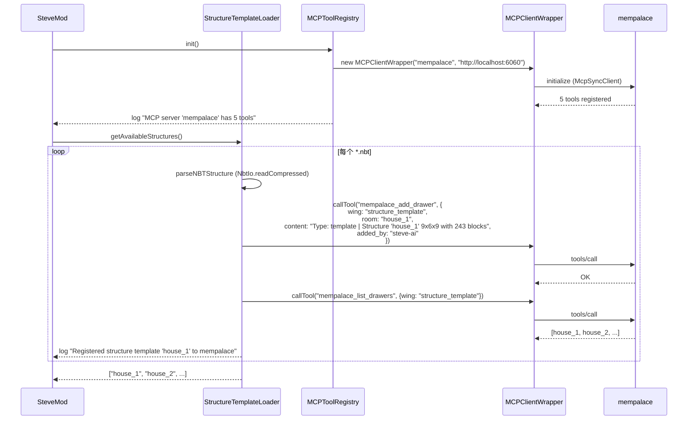
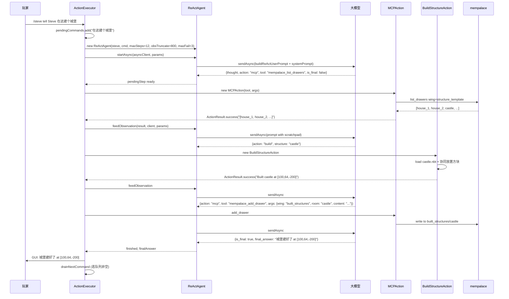
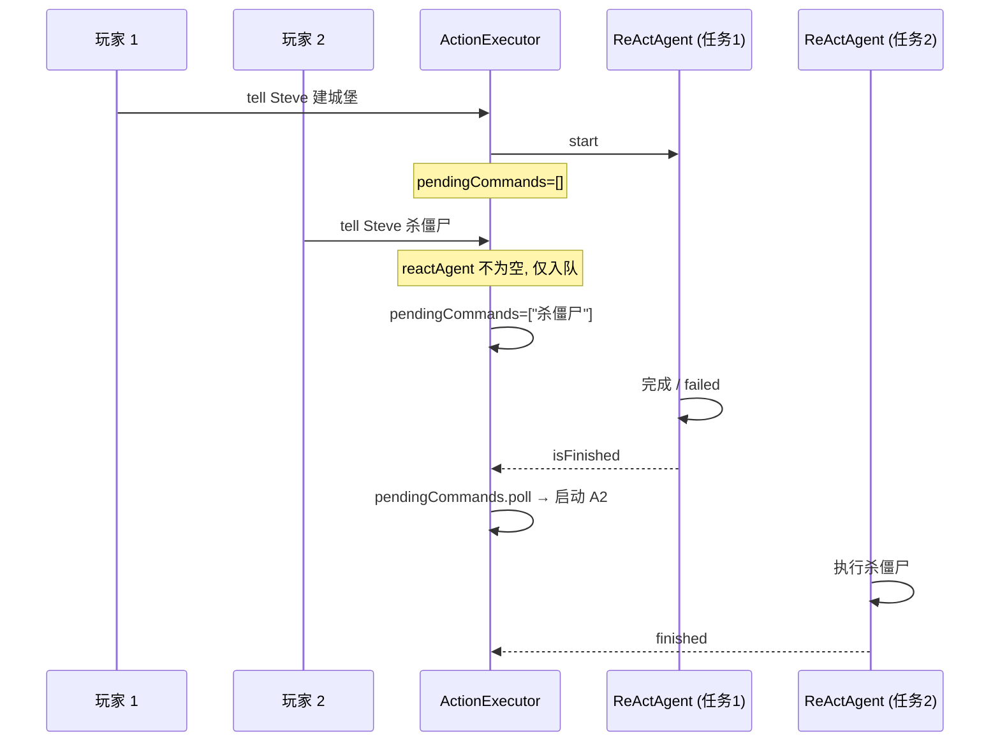
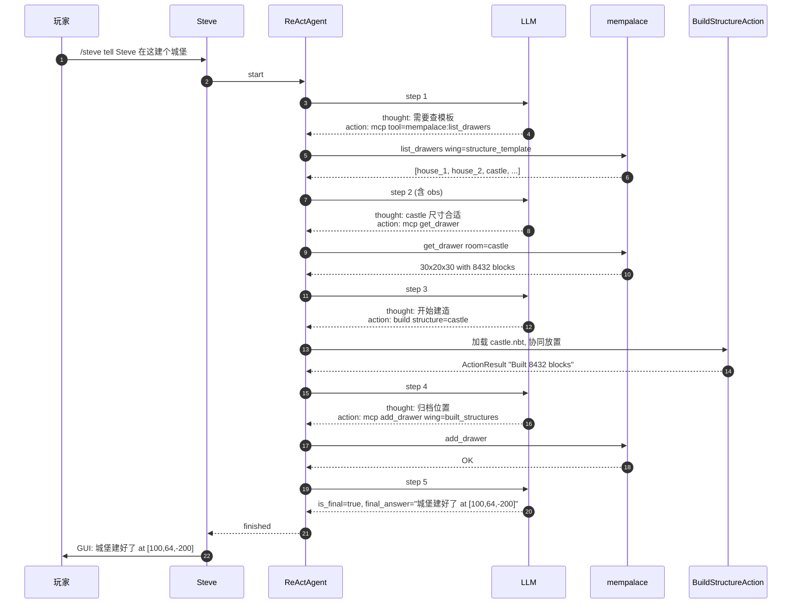

# Mempalace × ReAct：建筑模板调度与施工归档

## 1. 项目概述

### 1.1 背景

将 **mempalace**（外部 MCP 服务，作为建筑模板知识库 + 施工记录中枢）与 **ReAct 模式**（Reason + Act 思考-行动循环）结合，实现：

1. **模板注册** — 启动时把 `config/steve/structures/*.nbt` 模板元信息同步到 mempalace
2. **ReAct 调度** — LLM 通过 `mcp` action 查询可用模板，按用户需求选取
3. **协同建造** — Steve AI 根据选定模板执行建造（多 Steve 协作分象限）
4. **位置归档** — 建造完成后写回 mempalace，便于后续查询与避让
5. **长期记忆** — `SteveMemory.queryLongTermMemory()` 也走 mempalace，取代 NBT 持久化

### 1.2 核心技术

| 组件 | 路径 | 用途 |
|------|------|------|
| 模板加载 | `structure/StructureTemplateLoader` | 从 `config/steve/structures/*.nbt` 加载，命名规则 `{type}_{name}.nbt` |
| 模板注册 | `mcp/MCPClientWrapper` + `MCPToolRegistry` | `mempalace_add_drawer` 写入模板元信息 |
| 模板验证 | `mempalace_list_drawers` | 启动时验证注册成功 |
| ReAct 主循环 | `llm/react/ReActAgent` | Thought → Action → Observation 迭代 |
| LLM 调度 | `llm/PromptBuilder.buildReActSystemPrompt` | 把 MCP 工具列表注入到系统提示词 |
| 工具执行 | `action/actions/MCPAction` | LLM 输出 `action="mcp"` 时调用 |
| 位置归档 | `MCPAction` (mempalace_add_drawer) | 建造完成后写 `wing=built_structures` |
| 长期记忆 | `memory/SteveMemory.queryLongTermMemory` | 调 mempalace 检索历史对话 |

### 1.3 NBT 命名规范

`config/steve/structures/` 下的文件名采用 `{type}_{name}.nbt` 格式，启动时 `StructureTemplateLoader.getAvailableStructures()` 按下划线 split 两次：

| 文件名 | type | name | mempalace wing |
|--------|------|------|----------------|
| `template_house_1.nbt` | template | house_1 | `structure_template` |
| `template_house_2.nbt` | template | house_2 | `structure_template` |
| `decoration_tower.nbt` | decoration | tower | `structure_decoration` |
| `castle.nbt`（无下划线） | default | castle | `structure_default` |

仓库内已自带两个示例：`template_house_1.nbt`、`template_house_2.nbt`。

## 2. 整体架构

```mermaid
flowchart TB
    subgraph Startup["启动阶段"]
        S1[mod 启动] --> S2[SteveMod.onServerStarting]
        S2 --> S3[MCPToolRegistry.init]
        S3 --> S4[连接 mempalace @ localhost:6060]
        S2 --> S5[StructureTemplateLoader.getAvailableStructures]
        S5 --> S6[扫描 config/steve/structures/*.nbt]
        S6 --> S7[解析尺寸 + 方块数]
        S7 --> S8[MCPClientWrapper.callTool mempalace_add_drawer]
        S8 --> S9[注册到 wing=structure_{type}, room={name}]
        S9 --> S10[mempalace_list_drawers 验证]
    end

    subgraph Runtime["运行时 ReAct 循环"]
        R1[玩家 /steve tell Steve 在这建个城堡] --> R2[ActionExecutor.processNaturalLanguageCommand]
        R2 --> R3[pendingCommands.add]
        R3 --> R4{reactAgent 空闲?}
        R4 -->|是| R5[drainNextCommand 启动 ReActAgent]
        R5 --> R6[ReActAgent.startAsync: sendAsync 系统+用户提示词]
        R6 --> R7[LLM 输出 step 1: thought + mcp action]
        R7 --> R8[ActionExecutor.consumeNextStep → executeTask MCPAction]
        R8 --> R9[mempalace_list_drawers wing=structure_template]
        R9 --> R10[Observation: [house, castle, tower, ...]]
        R10 --> R11[ReActAgent.feedObservation 自动触发下一轮]
        R11 --> R12[LLM 输出 step 2: mcp get_drawer room=castle]
        R12 --> R13[Observation: castle 30x20x30]
        R13 --> R14[ReActAgent.feedObservation]
        R14 --> R15[LLM 输出 step 3: action=build structure=castle]
        R15 --> R16[executeTask BuildStructureAction]
        R16 --> R17[CollaborativeBuildManager 协同放置方块]
        R17 --> R18{建造完成?}
        R18 -->|是| R19[ActionResult 喂回 ReActAgent]
        R19 --> R20[LLM 输出 step 4: mcp add_drawer wing=built_structures]
        R20 --> R21[mempalace_add_drawer 位置归档]
        R21 --> R22[LLM 输出 step 5: is_final=true, final_answer]
        R22 --> R23[GUI 显示: 城堡建好了]
        R23 --> R24{队列空?}
        R24 -->|否| R5
        R24 -->|是| R25[转 IdleFollowAction]
    end
```

## 3. 数据流

### 3.1 启动时 — 模板注册



**失败容忍**：`MCPClientWrapper` 抛异常时 `StructureTemplateLoader` 只记录 warn 日志，不中断游戏。

### 3.2 运行时 — ReAct 调度



### 3.3 命令排队



## 4. mempalace 数据模型

### 4.1 Wing 分类

| Wing | 用途 | 写入时机 | 读取时机 |
|------|------|---------|---------|
| `structure_template` | 建筑模板元信息 | 启动时 `StructureTemplateLoader` | LLM 通过 `mempalace_list_drawers` 查询 |
| `structure_decoration` | 装饰类模板 | 启动时 | LLM 查询 |
| `structure_default` | 无下划线文件名（默认 type） | 启动时 | LLM 查询 |
| `built_structures` | 已建造建筑位置 | 建造完成后 ReAct 写回 | 后续查询 / 避免重复建造 |
| `steve_memory` | 长期记忆（按 steve 名称 room） | 玩家交互时 `SteveMemory.addAction` | `SteveMemory.queryLongTermMemory` |

### 4.2 Drawer 格式示例

模板元信息：
```json
{
  "wing": "structure_template",
  "room": "house_1",
  "content": "Type: template | Structure 'house_1' 9x6x9 with 243 blocks",
  "added_by": "steve-ai",
  "metadata": {
    "type": "template",
    "name": "house_1",
    "width": 9,
    "height": 6,
    "depth": 9,
    "block_count": 243
  }
}
```

已建建筑归档：
```json
{
  "wing": "built_structures",
  "room": "castle",
  "content": "Built castle at [100, 64, -200] by Steve-1",
  "added_by": "steve-ai"
}
```

## 5. 关键代码改动

### 5.1 `StructureTemplateLoader.java`

```java
public static List<String> getAvailableStructures() {
    List<String> structures = new ArrayList<>();
    File structuresDir = FMLPaths.CONFIGDIR.get().resolve("steve/structures").toFile();

    if (structuresDir.exists() && structuresDir.isDirectory()) {
        File[] files = structuresDir.listFiles((dir, name) -> name.endsWith(".nbt"));
        if (files != null) {
            for (File file : files) {
                String name = file.getName().replace(".nbt", "");
                structures.add(name);
                String[] parts = name.split("_", 2);
                String type = parts.length > 1 ? parts[0] : "default";
                registerStructureToMempalace(file, name, type);
            }
        }
    }
    return structures;
}

private static void registerStructureToMempalace(File file, String name, String type) {
    LoadedTemplate template = loadFromFile(file, name);
    if (template == null) return;

    MCPClientWrapper client = new MCPClientWrapper("mempalace", "http://localhost:6060");
    client.initialize();

    String content = String.format("Type: %s | Structure '%s' %dx%dx%d with %d blocks",
        type, template.name, template.width, template.height, template.depth, template.blocks.size());

    client.callTool("mempalace_add_drawer", Map.of(
        "wing", "structure_" + type,
        "room", template.name,
        "content", content,
        "added_by", "steve-ai"
    ));

    // 启动验证
    String queryResult = client.callTool("mempalace_list_drawers", Map.of("wing", "structure_" + type));
    SteveMod.LOGGER.info("Verified mempalace registration: {}", queryResult);

    client.close();
}
```

### 5.2 `ReActAgent.java`（新增）

```java
public class ReActAgent {
    private final StringBuilder scratchpad = new StringBuilder();
    private volatile boolean finished = false;
    private volatile ParsedResponse pendingStep = null;

    public void startAsync(AsyncLLMClient client, Map<String, Object> params) {
        runStep(client, params);  // 首次 LLM 调用
    }

    private void runStep(AsyncLLMClient client, Map<String, Object> baseParams) {
        Map<String, Object> params = new HashMap<>(baseParams);
        params.put("systemPrompt", PromptBuilder.buildReActSystemPrompt(maxSteps));
        String prompt = PromptBuilder.buildReActUserPrompt(steve, originalCommand, scratchpad);

        client.sendAsync(prompt, params).thenAccept(response -> {
            ResponseParser.ParsedResponse step = ResponseParser.parseReActStep(response.getContent());
            if (step.isFinal()) markFinished(step.getFinalAnswer());
            else pendingStep = step;
        });
    }

    public ParsedResponse consumeNextStep() { /* game thread 取出 */ }
    public void feedObservation(ActionResult result, AsyncLLMClient client, Map params) {
        appendScratchpad("[OK/FAIL] " + result.getMessage());
        runStep(client, params);  // 触发下一轮
    }
}
```

### 5.3 `PromptBuilder.buildReActSystemPrompt()`

```
ACTIONS (use these exact names):
- attack: {"target": "hostile|mob_name"}
- build: {"structure": "<template_name>"}
- mine: {"block": "<resource>", "quantity": <int>}
- follow: {"player": "<player_name>"}
- pathfind: {"x": <int>, "y": <int>, "z": <int>}
- mcp: {"tool": "<serverName:toolName>", "args": {<args>}}

OUTPUT FORMAT (one JSON object):
{"thought": "...", "action": "<name>", "parameters": {...}, "is_final": false}

When done:
{"thought": "...", "is_final": true, "final_answer": "..."}

AVAILABLE MCP TOOLS:
- mempalace:mempalace_list_drawers: List drawers with pagination
  args: {"wing": "structure_template"}
- mempalace:mempalace_get_drawer: Fetch a single drawer by ID
  args: {"wing": "structure_template", "room": "house_1"}
- mempalace:mempalace_add_drawer: Add a drawer
  args: {"wing": "structure_template", "room": "house_1", "content": "...", "added_by": "steve-ai"}
```

### 5.4 `ActionExecutor.drainNextCommand()`

```java
private void drainNextCommand() {
    String next = pendingCommands.poll();
    if (next == null) return;
    currentGoal = next;
    reactBaseParams = getTaskPlanner().buildReActParams();
    reactAgent = new ReActAgent(steve, next,
        SteveConfig.REACT_MAX_STEPS.get(),
        SteveConfig.REACT_OBS_TRUNCATE.get(),
        SteveConfig.REACT_FAIL_TOLERANCE.get());
    reactAgent.startAsync(getTaskPlanner().getAsyncClient(AI_PROVIDER), reactBaseParams);
}
```

## 6. 完整工作流

### 6.1 命令：`在这建个城堡`



### 6.2 错误处理

| 错误场景 | 处理 |
|---------|------|
| mempalace 未启动 | 启动时 `MCPClientWrapper.initialize` 抛异常，模板注册跳过但游戏继续 |
| 模板文件损坏 | `parseNBTStructure` 返回 null，记录 warn |
| 重复注册 | `mempalace_add_drawer` 幂等覆盖，每次启动刷新元信息 |
| 建造失败 | ReAct 喂回失败 observation，LLM 决定重试 / 换工具 / 标 is_final |
| LLM 解析失败 | 喂回 `[ERROR] Response not valid JSON`，递增 consecutiveFailures，达上限 failed |
| 连续命令 | `pendingCommands` 队列，当前 ReAct 完成后自动取下一条 |

## 7. 验证计划

### 7.1 启动验证

1. 启动 Minecraft（mempalace 服务运行在 `localhost:6060`）
2. 检查日志：
   ```
   [MCP] MCP server 'mempalace' has 5 tools
   [StructureTemplateLoader] Registered structure template 'house_1' (type: template) to mempalace
   [StructureTemplateLoader] Query mempalace after register: [house_1, house_2, ...]
   ```
3. 调 `mempalace_list_drawers wing=structure_template` 验证返回 `["house_1", "house_2"]`

### 7.2 ReAct 运行时验证

4. `/steve tell Steve build a house`
5. 日志确认多步：
   ```
   [ReAct step 1/12] Steve 'Steve' thinking for command: build a house
   [ReAct step 1/12] thought='...templates available' action=mcp params=...
   [MCPAction] Executing MCP tool: mempalace:mempalace_list_drawers
   [MCPAction] MCP tool '...' result: [house_1, house_2, ...]
   [ReAct step 2/12] thought='...' action=build params={structure: house_1}
   [ReAct step 3/12] thought='...' action=mcp add_drawer
   [ReAct step 4/12] FINAL: Built a house at [100, 64, -200]
   ```
6. GUI 弹 `Built a house at [100, 64, -200]`
7. `mempalace_list_drawers wing=built_structures` 返回 `["house_1"]`

### 7.3 命令排队验证

8. ReAct 进行中再发 `/steve tell Steve attack zombies`
9. 第一个完成前 GUI 提示 `Got it, will do after current task (queue: 1)`
10. 第一个完成后日志 `Drained command: attack zombies`，自动开始第二个

### 7.4 失败熔断验证

11. 把 LLM API key 改错
12. 启动时 `/steve tell Steve build a house`
13. 第一次 LLM 调用 `exceptionally` 触发 → `markFailed`
14. GUI 显示 `AI error: LLM call failed: ...`，队列保留不重试
15. `mempalace` 仍可独立调（不依赖 LLM 路径）

## 8. 优势

| 优势 | 说明 |
|------|------|
| 模板可发现 | LLM 通过 MCP 工具主动查询，无需硬编码模板列表 |
| 位置可追溯 | 所有建造记录保存在 mempalace，跨世界跨存档可查 |
| 思考可见 | ReAct 模式每步 LLM 思考 + 行动都进 scratchpad，可调试 |
| 失败可恢复 | observation 反馈让 LLM 自主调整重试 / 换工具 |
| 协同工作 | 多个 Steve 共享同一份模板库和建造记录 |
| 解耦 LLM 与 MCP | `MCPToolRegistry` 单例，mempalace 挂了不影响核心游戏逻辑 |
| 队列不丢 | 玩家连续发命令不丢失，按序处理 |
