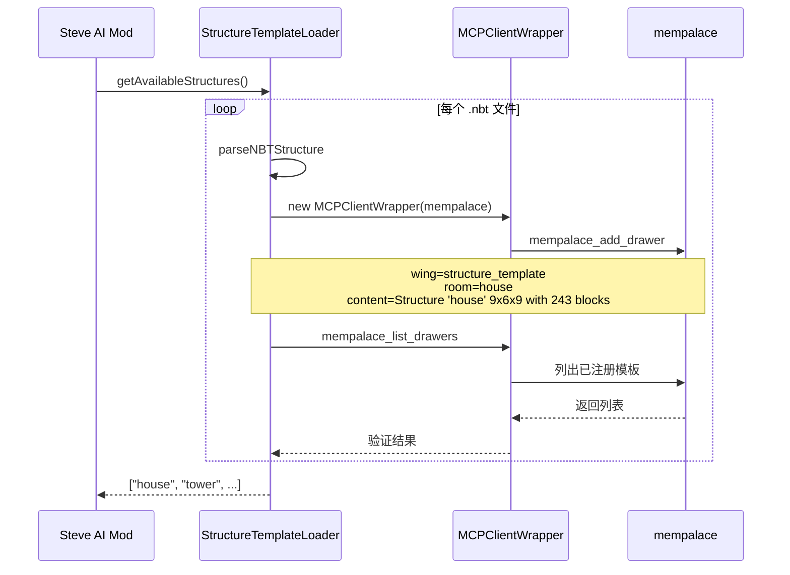
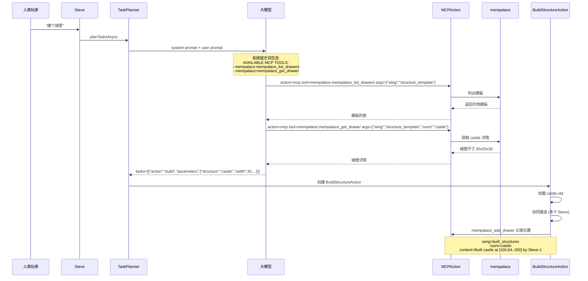
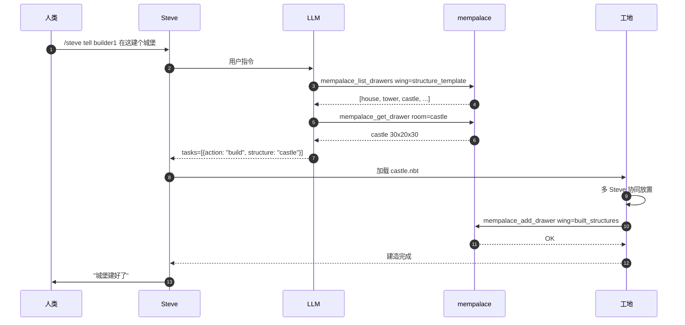

# 基于 Mempalace 的建筑模板调度系统

## 1. 项目概述

### 1.1 背景

将 mempalace（外部记忆宫殿服务）作为建筑模板的知识库和施工记录的中枢，实现：

1. **建筑模板初始化** - 启动时把 NBT 建筑模板元信息同步到 mempalace
2. **LLM 调度** - 大模型通过 MCP 工具查询可用模板，按用户需求选取
3. **协同建造** - Steve AI 根据选定模板执行建造
4. **位置归档** - 建造完成的位置信息写回 mempalace，方便后续查询

### 1.2 核心技术

| 组件 | 技术 | 用途 |
|------|------|------|
| 模板加载 | `StructureTemplateLoader` | 从 `config/steve/structures/*.nbt` 加载 |
| 模板注册 | `MCPClientWrapper` | 把模板元信息写入 mempalace |
| 模板发现 | `mempalace_list_drawers` | LLM 查询可用模板 |
| 位置记录 | `mempalace_add_drawer` | 写回建造完成的位置 |
| 任务执行 | `MCPAction` | LLM 通过 mcp action 调用工具 |

### 1.3 命名规范

模板文件名采用 `{type}_{name}.nbt` 格式：

| 文件名 | type | name | mempalace wing |
|--------|------|------|----------------|
| `template_house.nbt` | template | house | `structure_template` |
| `decoration_tower.nbt` | decoration | tower | `structure_decoration` |
| `castle.nbt` (无下划线) | default | castle | `structure_default` |

## 2. 整体架构

```mermaid
flowchart TB
    subgraph Startup["启动阶段"]
        A1[mod 启动] --> A2[StructureTemplateLoader.getAvailableStructures]
        A2 --> A3[扫描 config/steve/structures/*.nbt]
        A3 --> A4[解析每个 .nbt 尺寸 + 块数]
        A4 --> A5[mempalace_add_drawer 注册模板]
        A5 --> A6[mempalace_list_drawers 验证]
    end

    subgraph Runtime["运行时"]
        B1[人类: 在这建个城堡] --> B2[TaskPlanner.planTasksAsync]
        B2 --> B3[PromptBuilder.buildSystemPrompt]
        B3 --> B4[LLM 看到 MCP 工具列表]
        B4 --> B5[LLM 调用 mempalace_list_drawers 查询模板]
        B5 --> B6[LLM 选定 castle 模板]
        B6 --> B7[LLM 返回 build action: castle]
        B7 --> B8[ActionExecutor → BuildStructureAction]
        B8 --> B9[协同建造: 多个 Steve 放置方块]
        B9 --> B10{建造完成?}
        B10 -->|是| B11[mempalace_add_drawer 记录位置]
        B10 -->|否| B9
    end
```



## 3. 数据流向

### 3.1 启动时 - 模板注册



### 3.2 运行时 - LLM 调度



## 4. mempalace 数据模型

### 4.1 Wing 分类

| Wing | 用途 | 写入时机 | 读取时机 |
|------|------|---------|---------|
| `structure_template` | 建筑模板元信息 | 启动时 | LLM 查询可用模板 |
| `structure_decoration` | 装饰类模板 | 启动时 | LLM 查询 |
| `built_structures` | 已建造建筑位置 | 建造完成 | 后续查询/避免重复建造 |

### 4.2 Drawer 格式

```json
{
  "wing": "structure_template",
  "room": "house",
  "content": "Type: template | Structure 'house' 9x6x9 with 243 blocks",
  "added_by": "steve-ai",
  "metadata": {
    "type": "template",
    "name": "house",
    "width": 9,
    "height": 6,
    "depth": 9,
    "block_count": 243
  }
}
```

## 5. 关键代码改动

### 5.1 StructureTemplateLoader.java

```java
public static List<String> getAvailableStructures() {
    List<String> structures = new ArrayList<>();
    File structuresDir = FMLPaths.CONFIGDIR.get().resolve("steve/structures").toFile();

    if (structuresDir.exists() && structuresDir.isDirectory()) {
        File[] files = structuresDir.listFiles((dir, name) -> name.endsWith(".nbt"));
        if (files != null) {
            for (File file : files) {
                String name = file.getName().replace(".nbt", "");
                structures.add(name);
                // 解析 type_name
                String[] parts = name.split("_", 2);
                String type = parts.length > 1 ? parts[0] : "default";
                registerStructureToMempalace(file, name, type);
            }
        }
    }
    return structures;
}
```

### 5.2 PromptBuilder.java

系统提示词加入 MCP 工具：

```
=== AVAILABLE MCP TOOLS ===
- mempalace:mempalace_list_drawers: List drawers with pagination
  args: {"wing": "structure_template"}
- mempalace:mempalace_get_drawer: Fetch a single drawer by ID
  args: {"wing": "structure_template", "room": "house"}
- mempalace:mempalace_add_drawer: Add a drawer
  args: {"wing": "structure_template", "room": "house", "content": "...", "added_by": "steve-ai"}
```

### 5.3 BuildStructureAction.java

建造完成时记录位置：

```java
if (collaborativeBuild.isComplete()) {
    // 记录到 mempalace
    MCPClientWrapper client = new MCPClientWrapper("mempalace", "http://localhost:6060");
    client.initialize();
    client.callTool("mempalace_add_drawer", Map.of(
        "wing", "built_structures",
        "room", structureType,
        "content", String.format("Built %s at [%d, %d, %d] by %s",
            structureType, pos.getX(), pos.getY(), pos.getZ(), steve.getSteveName()),
        "added_by", "steve-ai"
    ));
    client.close();
}
```

## 6. 工作流示例

### 6.1 完整建造流程



### 6.2 错误处理

| 错误场景 | 处理 |
|---------|------|
| mempalace 服务未启动 | 启动时跳过注册，不影响游戏 |
| 模板文件损坏 | parseNBTStructure 返回 null，记录警告 |
| 重复注册 | 每次都注册最新尺寸（幂等） |
| 建造失败 | 不写 mempalace，只写成功的位置 |

## 7. 验证计划

### 7.1 启动验证

1. **启动 Minecraft** - 加载 mod
2. **检查日志** - 应看到：
   ```
   [MCP] Connecting to MCP server: mempalace at http://localhost:6060
   [MCP] MCP server 'mempalace' has 5 tools
   [MCP] === MCP Capabilities Summary: 5 total tools ===
   ```
3. **mempalace 验证** - 调用 `mempalace_list_drawers wing=structure_template` 应返回所有模板

### 7.2 运行时验证

4. **发送命令** `/steve tell Steve build a house`
5. **观察 LLM 调用** - 日志应显示：
   ```
   [Async] LLM 决定调用 mcp:mempalace_list_drawers
   [MCPAction] Executing MCP tool: mempalace:mempalace_list_drawers
   [MCPAction] MCP tool 'mempalace:mempalace_list_drawers' result: [...]
   ```
6. **观察建造** - Steve 开始建造
7. **建造完成** - mempalace 收到 `built_structures/house` 记录

### 7.3 数据查询

8. **查询模板列表** `mempalace_list_drawers wing=structure_template`
9. **查询已建建筑** `mempalace_list_drawers wing=built_structures`

## 8. 优势

| 优势 | 说明 |
|------|------|
| 模板可发现 | LLM 通过 MCP 工具主动查询，无需硬编码 |
| 位置可追溯 | 所有建造记录保存在 mempalace |
| 跨世界 | 数据独立于 Minecraft 存档 |
| 可扩展 | 新增模板只需添加 .nbt 文件 |
| 协同工作 | 多个 Steve 共享同一份模板库 |
